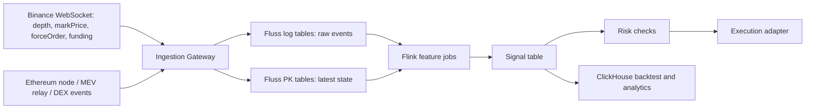

# 从 Binance 数据提炼 Alpha: Funding Rate 与 CEX-DEX 价差实时链路设计

采样时间: 2026-04-28 03:41 UTC, 2026-04-28 11:41 Asia/Shanghai  
数据来源: Binance USD-M Futures 公共 REST API, Binance Spot 公共 REST API, DEX Screener Uniswap V3 池快照  
状态说明: 已真实拉取 Binance 和 DEX 快照数据, 但未做实盘下单, 未做逐笔 order book 撮合回放, 所以下面的收益是研究口径估算, 不是可承诺收益。

## 1. 可以先这样讲

Darren 跟我说过要把数据提炼出 Alpha 来。所以我这几天用 Binance API 跑了一些数据, 看看能不能找到有意思的信号。

我先做了两个方向:

1. Funding Rate carry: 找极端资金费率, 用现货+永续合约对冲吃 funding。
2. CEX-DEX 价差: 对比 Binance 和 Uniswap V3 的实时价格, 判断哪些价差真的大到能覆盖 Gas、手续费和滑点。

这次 Funding Rate 是真实拉了 Binance USD-M Futures 数据: 先用 24h quoteVolume 筛出成交额最高的 80 个 USDT 永续合约, 再拉最近 7 天 funding history。79 个 symbol 成功返回, 1 个请求超时。这个口径比全市场扫描更接近真实策略, 因为小币就算 funding 高, 深度也可能根本吃不下仓位。

## 2. Funding Rate 7 天样本结论

### 2.1 数据口径

- Universe: Binance USD-M Futures, USDT perpetual, 24h 成交额前 80。
- History: `/fapi/v1/fundingRate`, 最近 7 天。
- 流动性字段: `/fapi/v1/ticker/24hr` 的 `quoteVolume`, `highPrice`, `lowPrice`, `lastPrice`。
- 年化口径: `7d_funding_sum * 365 / 7`。没有假设固定 8 小时一次, 因为这次样本里不同合约 funding 次数不完全一致, 有 21、42、75、102 等情况。
- Carry 方向: funding 为正时, 多头付空头, 策略方向是 long spot + short perp。funding 为负时, 方向反过来, 但需要考虑现货借币、可借规模和借币利率。

### 2.2 正 funding 候选

扣除成本口径:

- 轻量口径: 0.10% 开仓手续费 + 0.05% 滑点 = 0.15%。
- 保守口径: 开仓和出场都算一次, 约 0.30%。下面主要用轻量口径做初筛。

| Symbol | 7d funding sum | 年化 | 单次最高 funding | 最近一次 funding | 24h 高低区间/last | 24h quoteVolume | 轻量成本后 7d 净收益 |
|---|---:|---:|---:|---:|---:|---:|---:|
| DAMUSDT | 4.183% | 218.1% | 0.811% | 0.811% | 108.5% | $377M | 4.033% |
| RAVEUSDT | 2.761% | 144.0% | 0.134% | 0.047% | 10.2% | $84M | 2.611% |
| AGTUSDT | 1.920% | 100.1% | 0.168% | 0.049% | 35.5% | $72M | 1.770% |
| BSBUSDT | 1.749% | 91.2% | 0.192% | 0.017% | 39.7% | $539M | 1.599% |
| PIPPINUSDT | 1.376% | 71.7% | 0.075% | 0.005% | 24.5% | $34M | 1.226% |
| RIVERUSDT | 1.129% | 58.8% | 0.058% | 0.045% | 7.8% | $50M | 0.979% |
| MUSDT | 1.125% | 58.7% | 0.058% | 0.005% | 17.7% | $39M | 0.975% |
| VELVETUSDT | 1.102% | 57.5% | 0.122% | 0.005% | 22.7% | $45M | 0.952% |
| LABUSDT | 1.097% | 57.2% | 0.107% | 0.018% | 29.3% | $54M | 0.947% |
| AIOTUSDT | 1.023% | 53.3% | 0.076% | 0.028% | 32.9% | $170M | 0.873% |

样本里 7 天 funding 年化超过 50% 的正向合约有 10 个。如果只看平均 funding 年化超过 50%, 有 2 个, 说明大多数机会是短期脉冲, 不是稳定 carry。

比较值得继续看的不是最高的 DAMUSDT, 而是 RAVEUSDT、RIVERUSDT、AIOTUSDT 这类:

- DAMUSDT funding 很高, 但 24h 高低区间/last 达 108.5%, 这个更像清算潮或上市早期剧烈波动, 对冲不一定跟得上。
- RAVEUSDT 7 天 funding sum 2.761%, 24h 区间 10.2%, 交易额 $84M, 更像可进一步回放 order book 的候选。
- RIVERUSDT funding sum 1.129%, 年化 58.8%, 24h 区间只有 7.8%, 虽然收益低一些, 但风险收益形态更干净。
- AIOTUSDT 交易额 $170M, funding sum 1.023%, 但 24h 区间 32.9%, 需要看盘口深度和标记价格偏离。

### 2.3 负 funding 候选

| Symbol | 7d funding sum | 年化 | 单次最低 funding | 最近一次 funding | 24h 高低区间/last | 24h quoteVolume | 策略含义 |
|---|---:|---:|---:|---:|---:|---:|---|
| ORCAUSDT | -14.221% | -741.5% | -2.000% | -0.105% | 49.1% | $602M | long perp + short spot |
| KATUSDT | -11.668% | -608.4% | -1.576% | -0.001% | 17.6% | $72M | long perp + short spot |
| CHIPUSDT | -6.566% | -342.4% | -1.389% | -0.106% | 20.8% | $380M | long perp + short spot |
| PRLUSDT | -4.873% | -254.1% | -2.000% | -0.326% | 48.0% | $490M | long perp + short spot |
| ENSOUSDT | -4.696% | -244.9% | -1.191% | -0.046% | 12.0% | $54M | long perp + short spot |

负 funding 看起来更夸张, 但真实交易更难:

- 反向 carry 需要 short spot, 实际要么借币, 要么通过其他合约/借贷市场构造替代腿。
- 极端负 funding 经常来自空头拥挤、恐慌、上市初期或大规模强平后, 很容易遇到 funding 快速均值回归。
- ORCAUSDT 7 天 funding sum -14.221%, 如果理论上能稳定做 long perp + short spot, 收益非常高, 但它的单次 funding 到过 -2.000%, 24h 区间 49.1%, 这不是普通 carry, 更像事件驱动风险。

### 2.4 初步 Alpha 结论

1. Funding Rate 不是越高越好。最高 funding 往往伴随最高波动和最差执行确定性, 更适合做风险预警和清算后反转观察, 不一定适合直接 carry。
2. 真正可交易的候选要同时满足: 7d funding sum 高、24h range 不极端、quoteVolume 足够、盘口深度足够、现货和合约都能稳定成交。
3. Funding 极端值通常出现在清算潮之后, 所以 liquidation flow 可以作为先行指标。策略上不应该只看 funding, 应该把强平、open interest 变化、mark-index basis 一起放进特征。
4. 对冲策略的核心风险不是方向暴露, 而是腿不齐: 现货买不到/卖不掉、合约滑点变大、资金费率在建仓后快速回落、现货和永续的指数成分或风险限额变化。

## 3. CEX-DEX 快照结论

这部分没有做 7 天逐秒回放, 只做了一个实时快照, 用于判断价差量级。

数据口径:

- CEX: Binance spot `/api/v3/ticker/price`。
- DEX: DEX Screener pair API, Ethereum 上 Uniswap V3 主流池。
- 采样时间: 2026-04-28 03:41 UTC。

| Asset | Binance spot | Uniswap/Dex price | Spread | DEX liquidity |
|---|---:|---:|---:|---:|
| ETH | 2286.710000 | 2287.090000 | +0.017% | $100.7M |
| WBTC/BTC | 76794.500000 | 76727.062000 | -0.088% | $29.1M |
| LINK | 9.270000 | 9.240000 | -0.324% | $23.6M |
| UNI | 3.225000 | 3.220000 | -0.155% | $14.2M |

这组快照的结论很直接: 主流资产当前没有足够大的 CEX-DEX 价差。ETH 只有 0.017%, WBTC 0.088%, UNI 0.155%, LINK 0.324%。考虑 Uniswap LP fee、CEX taker fee、链上 Gas、MEV、跨场所库存成本和滑点, 这些都不构成可执行 arbitrage。

真正值得做 CEX-DEX 的不是“每分钟查一次价差”, 而是抓短窗口:

- 新币上线、链上池先动、CEX order book 后动。
- 大额 swap 打穿 DEX 池, CEX 暂时没跟上。
- CEX 强平导致永续和现货先偏离, 链上报价延迟修正。
- 跨链或桥相关资产出现局部流动性断层。

Dune 或普通 REST 分钟级数据更适合复盘, 不适合捕捉交易窗口。实盘链路需要链上事件秒级摄入, CEX 深度毫秒级摄入, 然后实时 join。

## 4. 外部策略参考与可迁移优化

这一轮又参考了几个公开项目和帖子, 结论是: 妖币策略不要只做单一 funding 或单一突破, 应该拆成四条互相验证、互相排斥的信号线。

### 4.1 Momentum Hunter: 早期突破追多/追空

参考: WooKiao 的 `Crypto-trading-Hunter`。这个仓库是 Rust + Tokio 的低延迟永续合约机器人, 接 Lighter 和 Gate.io WebSocket, 热路径做滑窗高低点、BBO、OI、价差判断, SQLite 和 Web UI 放在旁路, 避免阻塞信号处理。

它的核心信号可以抽象成:

```text
long_trigger =
  current_price >= rolling_low * (1 + jump_threshold)
  AND current_price == rolling_window_high
  AND prev_price 尚未突破阈值
  AND open_interest > min_oi
  AND spread <= max_spread

short_trigger 对称:
  current_price <= rolling_high * (1 - jump_threshold)
  AND current_price == rolling_window_low
```

可迁移点:

- 滑窗 min/max 用单调队列维护, 不要每个 tick 重扫窗口。
- 信号必须是“首次越过阈值”, 否则同一段行情会重复报警。
- 交易可执行性先于信号强度: OI 门槛、BBO spread、半档盘口 notional 都要过。
- 出场可以拆成多腿: 第一腿快速止盈, 第二腿吃趋势, 最后一腿 runner; 但妖币上 runner 比例不能太大。
- UI/数据库必须旁路化。热路径只更新状态机和发 signal event, 落库、PnL、dashboard 走异步 worker。

这个策略适合牛市或山寨季追强势启动, 不适合震荡市自动开单。它和 funding carry 的关系是互补的: funding carry 是相对低频持仓, Momentum Hunter 是极短线启动捕捉。

### 4.2 Accumulation Radar: 庄家收筹/暗流监控

参考: connectfarm1 的 `accumulation-radar`。公开 README 里把它定义为“横盘吸筹检测 + OI 异动监控 + 三策略独立评分”, 数据源是 Binance Futures K 线、24h ticker、open interest history、premium index, 以及 Binance 现货市值接口。

它的三类信号可以迁移成:

1. 追多/short-squeeze: 涨幅为正 + funding 为负 + 成交额过滤。负 funding 代表空头燃料, 价格继续涨会逼空。
2. 综合评分: funding、市值、横盘天数、OI 变化四维均衡。
3. 埋伏评分: 低市值 + OI 异动 + 长横盘 + 负 funding bonus。

更重要的是 OI/价格矩阵:

| OI | 价格 | 解读 | 用法 |
|---|---|---|---|
| 上升 | 上升 | 主动加仓做多/趋势确立 | 可作为突破确认 |
| 上升 | 下跌 | 主动加仓做空 | 可能形成 short fuel |
| 上升 | 横盘 | 暗流涌动/建仓 | 适合加入 watchlist |
| 下降 | 上涨 | 空头 squeeze 或平仓推动 | 谨慎追高 |
| 下降 | 下跌 | 多头平仓/止损潮 | 闪崩策略观察 |

这个雷达最适合做“候选池生成”, 不适合直接自动开单。它可以每天更新一次长期收筹池, 每小时或每 5 分钟更新 OI/funding 异动, 然后把候选池喂给更快的 Flink 策略。

### 4.3 Binance Alpha / 上所与叙事催化

参考: connectfarm1 的 `binance-alpha-monitor` 和用户给的妖币雷达思路。这个方向不是纯价格策略, 而是事件驱动:

- Binance Alpha 或多交易所集中上新。
- Tier-1 上所次数, 尤其 Binance、OKX、Bitget、Coinbase、Upbit、Bybit、Bithumb。
- VC/叙事/FDV/流通市值。
- 上线前倒计时、上线后 30 分钟追踪、翻倍/腰斩异动推送。

可迁移到我们架构里的特征:

```text
listing_score =
  tier1_listing_count_14d * 20
  + unique_exchange_count_14d * 8
  + binance_alpha_bonus
  + hot_narrative_bonus
  + low_float_bonus
  - unlock_risk_penalty
```

这个分数不要直接作为买入信号, 而应该作为 universe 权重。比如同样命中 funding/OI/突破信号, 近期多交易所上所且叙事强的币优先级更高。

### 4.4 V4A-Flash: 暴涨回撤做空

参考用户贴的 Skanda/V4A-Flash 思路。关键不是预测启动, 而是等妖币已经进入操纵状态后, 在庄家弃盘/多头衰竭时抢第一段下跌。

核心假设:

- 妖币庄的资金有成本, 趋势形成后不会无限逆势护盘。
- 预测启动和摸顶都容易过拟合, 真正可执行的是暴涨后的早期回撤。
- 持仓要短, 出场要快, 信号只做 alert 或小仓验证, 不直接满自动化。

候选过滤:

- 先按上币时间、解锁状态、流通结构分组。
- ban 低成交量、接近全流通 meme、深度太差的币。
- 关注新合约和“项目结束但仍有合约/低市值/无人关注”的老币。

入场模板:

```text
flash_short_setup =
  24h 或 48h 累计涨幅足够大
  AND 4h 动能衰竭
  AND 1h 出现 lower high 或首次回撤破位
  AND 当前盘口可成交 notional >= 目标仓位 * 3
  AND funding 不再继续支持多头拉升

exit =
  trail on favorable move
  OR wide_stop_loss
  OR max_hold_time = 8h
```

注意这里要非常防 look-ahead bias。不能用未来 K 线确定 peak、支撑位、lower high。实盘实现必须只用当下已闭合 K 线和当前 tick。

### 4.5 用当前 Binance 数据做一次多因子快照

采样时间: 2026-04-28 04:23 UTC。Universe: Binance USDT 永续 24h 成交额前 60, 成功拉到 57 个 OI 样本。

Short-squeeze 候选口径: `24h 涨幅 > 3% AND funding < 0 AND OI 1h 上升 AND 24h 成交额 > $20M`。

| Symbol | 24h 涨幅 | 最新 funding | OI 1h | OI 6h | 24h quoteVolume | 解读 |
|---|---:|---:|---:|---:|---:|---|
| ZKJUSDT | +33.4% | -0.6422% | +2.4% | +74.4% | $49M | 最像逼空结构: 涨幅大、费率极负、OI 6h 大增 |
| ORCAUSDT | +13.4% | -0.0739% | +2.0% | +4.5% | $603M | 流动性好, 但前面 funding 已极端, 需防回撤 |
| AXSUSDT | +5.7% | -0.0247% | +6.6% | +4.7% | $90M | 更像温和 squeeze, 可做观察 |

Flash-short 候选口径: `24h 涨幅 > 20% AND 成交额 > $20M`。

| Symbol | 24h 涨幅 | 最新 funding | OI 1h | OI 6h | 24h quoteVolume | 解读 |
|---|---:|---:|---:|---:|---:|---|
| DAMUSDT | +138.8% | +1.1271% | -8.2% | +13.6% | $388M | 暴涨后 OI 1h 下降, 更像闪崩观察池, 不适合追多 |
| PRLUSDT | +44.1% | -0.5136% | -0.4% | +10.4% | $497M | 涨幅大且 funding 负, 可能仍有 squeeze, 做空要等 lower high |
| ZKJUSDT | +33.4% | -0.6422% | +2.4% | +74.4% | $49M | 同时命中 squeeze 与 flash-short 观察, 需要更细 K 线确认方向 |

这个样本说明一件事: 同一个币可能同时被不同策略看上, 但方向相反。ZKJ 对追多是 short-squeeze 候选, 对做空是暴涨后潜在 flash-short 候选。解决方法不是拍脑袋选方向, 而是做“策略仲裁”:

```text
if squeeze_score 高 and flash_short_score 高:
  不自动开单
  降级为人工盯盘/等待 1h lower high 或 funding 回升
elif squeeze_score 高 and flash_short_score 低:
  允许短线追多
elif flash_short_score 高 and squeeze_score 低:
  等第一次 lower high 后做空
```

### 4.6 融合后的策略分层

| 层 | 目标 | 输入 | 输出 | 更新频率 |
|---|---|---|---|---|
| Universe | 找哪些币值得盯 | 上所、FDV、解锁、横盘、市值、历史操纵频率 | watchlist | 每天/每小时 |
| Fuel | 判断多空燃料 | funding、OI、清算、long/short ratio | squeeze/flush pressure | 1m-5m |
| Trigger | 找入场点 | tick/BBO、1m/5m/1h K线、lower high、breakout | long/short signal | tick-1m |
| Execution | 判断能否成交 | spread、book depth、min notional、slippage、cooldown | order intent | tick |
| Exit | 控制持仓时间 | trail、反弹苗头、max hold、funding reversal | close/reduce | tick-1m |

新增表:

```sql
CREATE TABLE token_universe_features (
  symbol STRING,
  listed_at TIMESTAMP(3),
  tier1_listing_count_14d INT,
  exchange_count_14d INT,
  fdv DOUBLE,
  circulating_mcap DOUBLE,
  unlock_days INT,
  unlock_risk STRING,
  sideways_days INT,
  range_pct_90d DOUBLE,
  manipulation_score DOUBLE,
  updated_at TIMESTAMP(3),
  PRIMARY KEY (symbol) NOT ENFORCED
);

CREATE TABLE perp_fuel_features (
  symbol STRING,
  funding_rate DOUBLE,
  funding_8h_avg DOUBLE,
  funding_zscore DOUBLE,
  oi_usd DOUBLE,
  oi_change_1h DOUBLE,
  oi_change_6h DOUBLE,
  liquidation_long_1h DOUBLE,
  liquidation_short_1h DOUBLE,
  price_change_24h DOUBLE,
  quote_volume_24h DOUBLE,
  updated_at TIMESTAMP(3),
  PRIMARY KEY (symbol) NOT ENFORCED
);

CREATE TABLE strategy_arbitration (
  symbol STRING,
  squeeze_score DOUBLE,
  accumulation_score DOUBLE,
  momentum_score DOUBLE,
  flash_short_score DOUBLE,
  final_action STRING,
  reason STRING,
  updated_at TIMESTAMP(3),
  PRIMARY KEY (symbol) NOT ENFORCED
);
```

优化后的实时链路:

```text
slow features: 上所/FDV/解锁/声量/横盘
  -> token_universe_features

fast features: funding/OI/liquidation/BBO/Kline
  -> perp_fuel_features + latest_book

Flink arbitration
  -> 同币多策略冲突检测
  -> signal with action: watch / long / short / no-trade
```

### 4.7 对原文档结论的修正

原文档偏 Funding Carry 和 CEX-DEX arbitrage, 现在应该加一个更贴近当前行情的判断:

- Funding 极端不只用于 carry, 也可以作为妖币 squeeze/flash 的燃料特征。
- 负 funding + 价格上涨 + OI 上升, 更像短线逼空追多, 不是 carry。
- 暴涨后 funding 仍极端、OI 开始下降、1h lower high 出现, 才更接近 V4A-Flash 做空。
- 多交易所上所、FDV、解锁、声量和 KOL 关注变化, 主要用于候选池和优先级, 不直接决定入场。
- 自动交易的最低要求是策略仲裁。单个币同时命中追多和做空时, 默认不自动交易。

## 5. 推荐实时架构: Fluss + Flink

### 5.1 总体链路



Fluss 在这里负责两类表:

- Log table: append-only 原始事件, 比如 `cex_depth_events`, `dex_swap_events`, `liquidation_events`。
- Primary key table: 最新状态, 比如 `latest_funding_rate`, `latest_best_bid_ask`, `latest_pool_price`, `risk_limits`。

Apache Fluss 0.9 文档里 Primary Key Table 支持 `INSERT`、`UPDATE`、`DELETE`, 同一个 primary key 多次写入时保留最后一条, 并支持 primary key lookup。Flink 写 Fluss 时, primary-key table 可接收 upsert/changelog, log table 只能 append insert。Delta Join 在 Flink 2.1+ 里可以把传统 streaming join 转成基于 Fluss source table 的索引查找, 减少 Flink state。

### 5.2 Funding Rate 策略流程

实时链路:

```text
Binance funding/mark price WebSocket
  -> ingestion normalize
  -> Fluss latest_funding_rate PK table
  -> Flink sliding window features
  -> signal_funding_carry
  -> risk engine
  -> execution
```

核心表设计:

```sql
CREATE TABLE latest_funding_rate (
  exchange STRING,
  symbol STRING,
  funding_time TIMESTAMP(3),
  funding_rate DOUBLE,
  mark_price DOUBLE,
  next_funding_time TIMESTAMP(3),
  event_time TIMESTAMP(3),
  PRIMARY KEY (exchange, symbol) NOT ENFORCED
) WITH (
  'bucket.num' = '64',
  'bucket.key' = 'exchange,symbol'
);

CREATE TABLE funding_rate_events (
  exchange STRING,
  symbol STRING,
  funding_time TIMESTAMP(3),
  funding_rate DOUBLE,
  mark_price DOUBLE,
  ingest_time TIMESTAMP(3)
);

CREATE TABLE signal_funding_carry (
  signal_id STRING,
  symbol STRING,
  side STRING,
  funding_sum_7d DOUBLE,
  funding_ann DOUBLE,
  vol_24h DOUBLE,
  quote_volume_24h DOUBLE,
  expected_net_7d DOUBLE,
  confidence DOUBLE,
  created_at TIMESTAMP(3),
  PRIMARY KEY (signal_id) NOT ENFORCED
);
```

信号逻辑:

```sql
INSERT INTO signal_funding_carry
SELECT
  MD5(CONCAT(symbol, CAST(window_end AS STRING))) AS signal_id,
  symbol,
  CASE WHEN SUM(funding_rate) > 0 THEN 'LONG_SPOT_SHORT_PERP'
       ELSE 'LONG_PERP_SHORT_SPOT'
  END AS side,
  SUM(funding_rate) AS funding_sum_7d,
  SUM(funding_rate) * 365 / 7 AS funding_ann,
  MAX(range_24h) AS vol_24h,
  MAX(quote_volume_24h) AS quote_volume_24h,
  ABS(SUM(funding_rate)) - 0.0015 AS expected_net_7d,
  CASE
    WHEN MAX(range_24h) < 0.12 AND MAX(quote_volume_24h) > 50000000 THEN 0.8
    WHEN MAX(range_24h) < 0.25 AND MAX(quote_volume_24h) > 30000000 THEN 0.6
    ELSE 0.3
  END AS confidence,
  CURRENT_TIMESTAMP
FROM funding_features_7d
WHERE ABS(SUM(funding_rate)) * 365 / 7 > 0.5
GROUP BY symbol, window_end;
```

风控校验:

- 两腿都必须能成交: 现货深度、合约深度、最小下单量、最大杠杆和风险限额。
- funding 不追高: 如果最近单次 funding 超过过去 7 天 P95 太多, 信号降权, 因为容易均值回归。
- 波动过滤: 24h high-low/last 超过 25% 的币种默认进入观察池, 不直接执行。
- 事件过滤: 上市首日、合约参数调整、交易暂停、指数成分变化时不交易。
- 库存过滤: 反向 carry 需要 borrow inventory, 借币利率必须小于 funding edge。

### 5.3 CEX-DEX 价差策略流程

实时链路:

```text
CEX depth stream
  -> Fluss latest_cex_book PK table

DEX Swap / Sync / Pool state events
  -> Fluss latest_dex_pool PK table

Flink Delta Join on normalized asset
  -> spread signal
  -> gas/slippage/MEV/risk check
  -> execution or alert
```

核心表:

```sql
CREATE TABLE latest_cex_book (
  venue STRING,
  asset STRING,
  symbol STRING,
  best_bid DOUBLE,
  best_ask DOUBLE,
  bid_qty DOUBLE,
  ask_qty DOUBLE,
  event_time TIMESTAMP(3),
  PRIMARY KEY (venue, asset) NOT ENFORCED
) WITH (
  'bucket.num' = '64',
  'bucket.key' = 'asset'
);

CREATE TABLE latest_dex_pool (
  chain STRING,
  dex STRING,
  pool_address STRING,
  asset STRING,
  quote_asset STRING,
  price_usd DOUBLE,
  liquidity_usd DOUBLE,
  fee_bps INT,
  block_number BIGINT,
  event_time TIMESTAMP(3),
  PRIMARY KEY (chain, pool_address) NOT ENFORCED
) WITH (
  'bucket.num' = '64',
  'bucket.key' = 'asset'
);
```

价差公式:

```text
spread_buy_dex_sell_cex = cex_bid / dex_effective_buy_price - 1
spread_buy_cex_sell_dex = dex_effective_sell_price / cex_ask - 1

net_edge = gross_spread
  - cex_fee
  - dex_lp_fee
  - expected_slippage
  - gas_cost / notional
  - mev_protection_cost
  - inventory_rebalance_cost
```

信号阈值不应该固定 1%。对 ETH 这种深池, 0.20% 可能已经值得关注; 对小币, 2% 也可能不够, 因为实际能成交的 size 很小。

## 6. ClickHouse 对比

ClickHouse 不是不能做这件事, 它很适合做历史分析、回测、报表和特征复盘。但如果目标是秒级甚至毫秒级信号, Fluss + Flink 更自然。

| 维度 | Fluss + Flink | ClickHouse |
|---|---|---|
| 最新状态读取 | PK table 可按主键 lookup, 适合 `symbol -> latest state` | MergeTree primary key 是稀疏索引, 不是 OLTP 唯一键 |
| 更新语义 | Primary Key Table upsert/changelog 更自然 | ReplacingMergeTree 可做去重/最新版, 但合并是后台过程, 查询强一致通常要 `FINAL` 或额外设计 |
| 实时 Join | Flink Delta Join 可用 Fluss source table lookup 减少 state | 可以 JOIN, 但更偏查询时计算或物化视图预聚合 |
| 原始事件存储 | Log table 保留 append-only 事件 | 非常适合, ClickHouse 强项 |
| 回测分析 | 可以, 但不是最强项 | 非常适合窗口聚合、分桶、报表、历史回测 |
| 风控最新状态 | 适合做在线 state serving | 需要额外 latest 表、Dictionary、KeeperMap 或外部 KV |
| 运维风险 | Fluss 仍在 Apache Incubator, 版本演进快 | 生态成熟, 但实时 upsert/强一致最新版要设计清楚 |

更准确的说法是:

ClickHouse 如果表按 `(symbol, event_time)` 排序, 查询单个 symbol 的 7 天 funding 不会扫全表, 稀疏索引和分区能剪枝。但当信号计算需要持续对全市场做最新状态点查、跨流 join、低延迟风控校验时, ClickHouse 会逐渐变成“分析库兼在线库”, 需要更多物化视图和补偿逻辑。Fluss 的 PK table 更贴近这个在线状态层。

推荐组合:

- Fluss: 最新状态、在线 lookup、实时 join。
- Flink: 特征计算、窗口聚合、信号生成。
- ClickHouse: 原始事件落盘、回测、dashboard、post-trade analysis。

## 7. 真实落地会踩的坑

### Funding Rate

- Funding interval 不一定都是固定 8 小时, 不能用 `rate * 3 * 365` 简单年化所有合约。最好用实际 funding 次数和时间跨度归一化。
- Funding API 返回按时间升序, 如果时间范围超过 limit 会从 `startTime + limit` 截断, 需要分页。
- 极端 funding 往往很快消失, 用 REST 每几分钟拉一次会错过建仓窗口。
- Mark price 和 last price 不一致时, 回测 PnL 要用 mark price 做保证金风险, 用可成交价格做执行成本。
- 现货腿和合约腿的交易规则不同: step size、min notional、price tick、最大杠杆、风险限额都要分别处理。
- 做负 funding 时, short spot 的 borrow rate、borrow availability 和强平机制往往比 funding 本身更重要。

### CEX-DEX

- DEX 报价必须用池状态模拟实际成交, 不能只看 `priceUsd`。大额交易会把 AMM 曲线打滑。
- Uniswap V3 需要按 tick/liquidity 分段模拟, 不是一个简单的 constant product。
- Gas 成本要按 notional 折算。小额价差看起来大, 但 Gas 可能直接吃掉全部利润。
- MEV 会让链上腿的成交价格变差。没有 private relay 或保护机制时, 回测会高估收益。
- CEX depth stream 有序列号, 断线后必须重新 snapshot + replay, 否则本地 order book 会漂。
- 链上事件有 reorg, 信号可以先 soft-confirm, 执行前再按确认数和池状态二次校验。

## 8. 下一步实验

1. Funding replay: 对 RAVEUSDT、RIVERUSDT、AIOTUSDT、ORCAUSDT 做逐小时资金费率、mark-index basis、24h realized vol、open interest 联合回放。
2. Execution replay: 拉 Binance depth snapshot + aggTrades, 估计 $10k、$50k、$100k notional 的真实滑点。
3. Liquidation lead-lag: 用 forceOrder stream 回放清算流, 检查清算脉冲领先 funding 极值多少分钟。
4. CEX-DEX replay: 选 ETH、LINK、UNI 和 2-3 个长尾币, 用链上 Swap 事件和 CEX book ticker 做秒级 join, 统计超过净收益阈值的持续时间。
5. ClickHouse baseline: 同一批事件落 ClickHouse, 做 materialized view + AggregatingMergeTree, 对比端到端延迟、查询 CPU、信号漏报率。

## 9. 参考链接

- WooKiao/Crypto-trading-Hunter: https://github.com/WooKiao/Crypto-trading-Hunter
- connectfarm1/accumulation-radar: https://github.com/connectfarm1/accumulation-radar
- connectfarm1/binance-alpha-monitor: https://github.com/connectfarm1/binance-alpha-monitor
- 妖币雷达页面快照: https://app.guamee.uk/
- Binance USD-M Futures Funding Rate History: https://developers.binance.com/docs/derivatives/usds-margined-futures/market-data/rest-api/Get-Funding-Rate-History
- Binance USD-M Futures 24hr Ticker: https://developers.binance.com/docs/derivatives/usds-margined-futures/market-data/rest-api/24hr-Ticker-Price-Change-Statistics
- DEX Screener API Reference: https://docs.dexscreener.com/api/reference
- Apache Fluss Primary Key Table: https://fluss.apache.org/docs/table-design/table-types/pk-table/
- Apache Fluss Flink Writes: https://fluss.apache.org/docs/engine-flink/writes/
- Apache Fluss Flink Delta Join: https://fluss.apache.org/docs/engine-flink/delta-joins/
- ClickHouse MergeTree: https://clickhouse.com/docs/engines/table-engines/mergetree-family/mergetree
